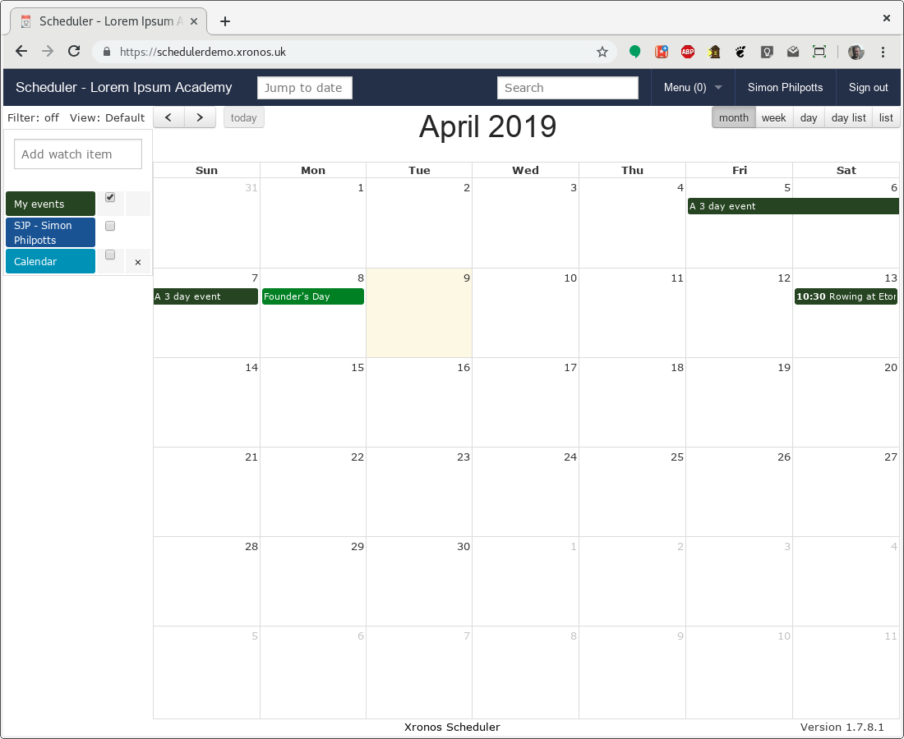

Dates and date handling
=======================

The handling of dates in any kind of computer program is prone to
causing far more confusion than one might expect.  They're simple
aren't they?  No.

Most programming languages include facilities for the handling of
dates and times, probably including the correct handling of time
zones and daylight saving time.  The computer is very precise and
consistent in the way it handles them.

If you give the computer a date like "2019-03-01" it will almost
certainly store it as a date and time - ``2019-03-01 00:00:00``.  That is,
midnight at the start of the 1st of March 2019.  It will do this
with any date which you give it.

People on the other hand are not so consistent.  The main stumbling
point is how we refer to the duration of an event which lasts a whole
number of days.

Events with times are easy - we might say that an event starts at 2pm
and ends at 4pm.  We don't really need to worry about whether the
exact instants of 2pm and 4pm are included - they're too short to worry
about.  The computer would store the start time as ``2019-03-01 14:00:00``
and the end time as ``2019-03-01 16:00:00``.  Any calculations which you
might care to do with these two date/times - e.g. calculating the duration
by subtracting one from the other - will work exactly as you would
expect.

However, when an event lasts a whole number of days then it's not
quite so simple.  We might say, "The public holiday is on the 3rd",
or "I am away from the 5th to the 7th".  There are two implicit
pieces of information here which a human would naturally understand,
but a computer won't unless we do things right.  In the first
case, the implicit piece of information is that the event lasts all
day - it ends at the end of the 3rd.  In the second case, what is
meant is that the event runs from the *start* of the 5th to the
*end* of the 7th.

The start time for our public holiday is ``2019-03-03 00:00:00``
but the end time is ``2019-03-04 00:00:00``.  This can really surprise
people.  You can if you prefer think of the latter time as
``2019-03-03 24:00:00`` but you'll almost certainly find that your
programming language libraries convert it immediately back into
``2019-03-04 00:00:00``.

In the second case, my absence is from ``2019-03-05 00:00:00`` to
``2019-03-08 00:00:00``.

It is absolutely vital that the date/times are stored internally to
a program in this way, because otherwise no calculations on them will
work.  The calculation of durations will come out wrong; the calculation
of overlaps will come out wrong.  Nothing will work quite right.

However, it is completely unreasonable to expect end users to change
their habits and ways of expressing themselves to accommodate the computer.
That's not the way round in which it should work - the computer should
do the work to accommodate the human.

Happily, once the problem has been clearly laid out, the solution is
easy.

- If the user enters a single date for an event, take it as meaning
  the whole of that day and set the end time accordingly.
- If the user enters a start date and an end date, store the start
  date as given, but add 1 day to the end date and store that.
- When displaying durations back to the user in textual form,
  reverse these two bits of data massaging.

Note that this work is only needed if we're handling textual dates,
whether typed in or picked from some kind of date selector.  When a
user is using a graphical interface to set or view the duration of an
event, the confusion doesn't arise.  If an event runs from the 5th
to the 7th, the user expects to see the bar run from the start of the
5th to the start of the 8th.  If it ran just to the start of the 7th,
he or she would be surprised and confused.  There's only a problem
when we're describing the duration using words.

See the sample to the right for a graphical version of this event.

Why is this relevant to Scheduler?  Because all this work has been
done for you already.  Scheduler stores the start and end date/times
for events in the way described above, and contains code to handle
the subtle nuances of human language in the way which people expect.
The API builds on this when allowing you to create events.

The three fields which you use to specify the timing of an event
are:

- start_time_text
- end_time_text
- all_day_field

So if you were to send an event creation request with:

::

  event: {
    start_time_text: "2019-03-03",
    all_day_field:   true
  }

The system will realise that the end time should be set to 1 day
later and fill it in for you automatically.

Similarly, if you were to send:

::

  event: {
    start_time_text: "2019-03-05",
    end_time_text:   "2019-03-07",
    all_day_field:   true
  }

It will realise that you want your event to start at the beginning
of the 5th and end at the end of the 7th.

.. note::

  The above text refers several times to "1 day later".  It's tempting
  to think of this as being the same as "24 hours later", but it's not.
  Some days have 23 or 25 hours.  All this is taken care of for you.

